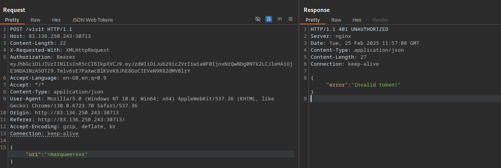

## Challenge info
- name suggests there has to be a web cache poisoning vulnerability
- have not noticed any interesting requests from the core functionalities
- there is a visit endpoint that needs to be probed a bit

```python
@bot_bp.route('/visit', methods=['POST'])
@jwt_required
def visit():

    data = request.get_json()

    uri = data.get('uri')
    
    if not uri:
        return jsonify({"message": "URI is required"}), 400

    bot_thread(uri)

    return jsonify({"message": f"Visiting URI: {uri}"}), 200
```

- this means a POST request may be maid to /visit with an uri field in the json body : no luck
