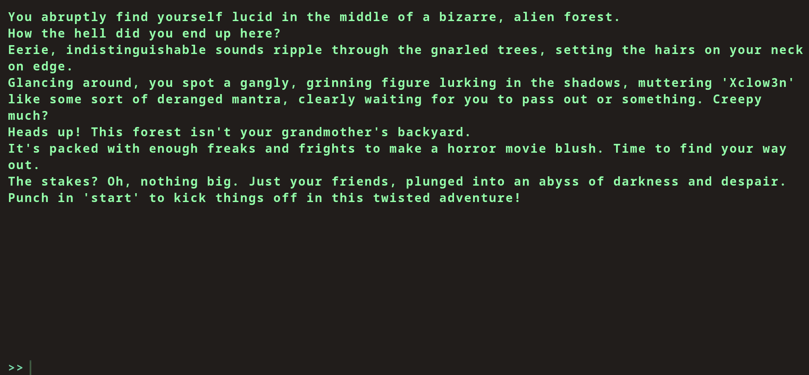
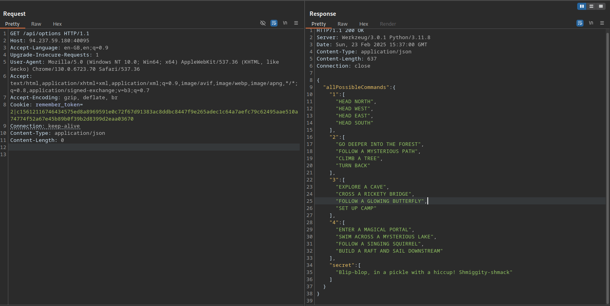
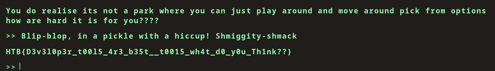
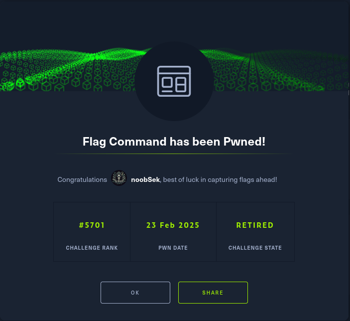

## Challenge info


looks like a js based challenge
have to figure out the correct message to get the flag
analyze the apis and other server calls


> interesting: /static/terminal/js/main.js

```js

const fetchOptions = () => {
    fetch('/api/options')
        .then((data) => data.json())
        .then((res) => {
            availableOptions = res.allPossibleCommands;

        })
        .catch(() => {
            availableOptions = undefined;
        })
}
```


## key captured:



## flag captured:


HTB{D3v3l0p3r_t00l5_4r3_b35t__t0015_wh4t_d0_y0u_Th1nk??}

## Yay !

